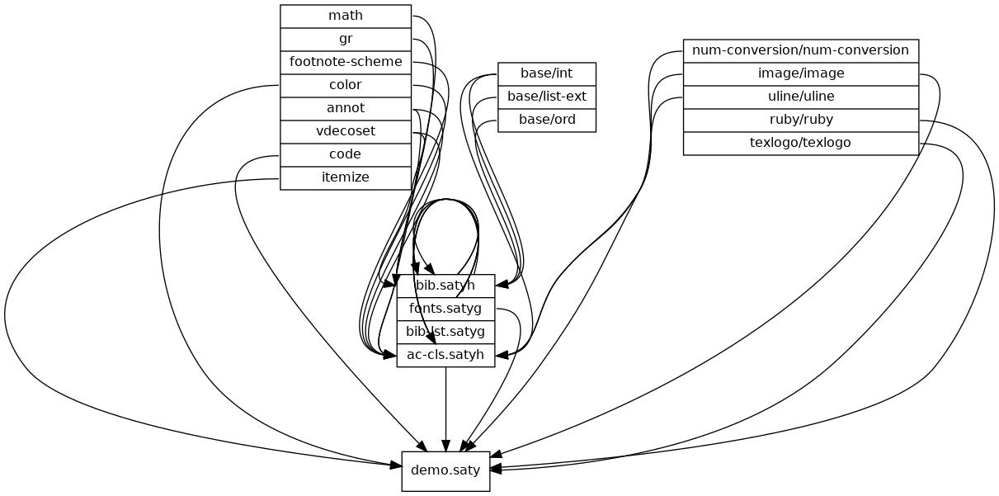

これは筑波大学AC入試のために作成した、自己推薦書用のクラスファイルとそのデモファイルです。

動作はSATySFiのバージョンが0.0.6以上、0.1.0未満であることが必要です。

```
make dot
```

で必要なチャート図を生成し、

```
make satysfi
```

でデモファイルのコンパイルが行われます。

デモファイルのPDFは

- [https://puripuri2100.github.io/tukuba-AC-cls/demo.pdf](https://puripuri2100.github.io/tukuba-AC-cls/demo.pdf)

で見ることができます。


各パッケージの依存関係はこのようになっています。


